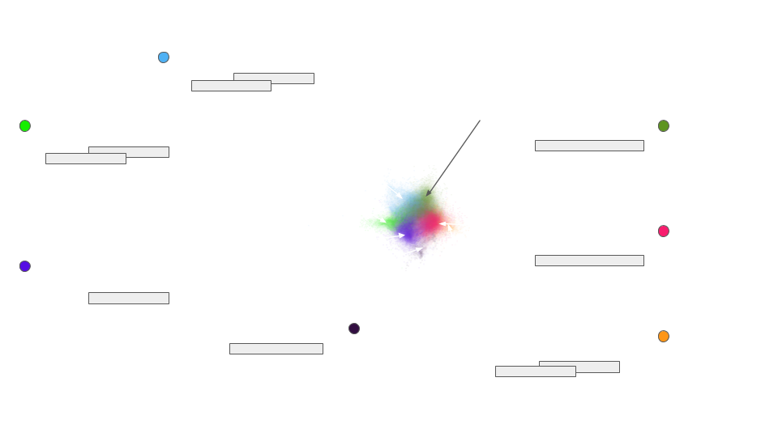

# Drilling: identifying groups and their topics of interest

Based on a new method and large scale social media mining by Clement Levallois et al.

Accurate on any topic and any language.

The results of the drilling are delivered in visual and tabular formats.

*Inquiries: analysis@exploreyourdata.com* or @seinecle

